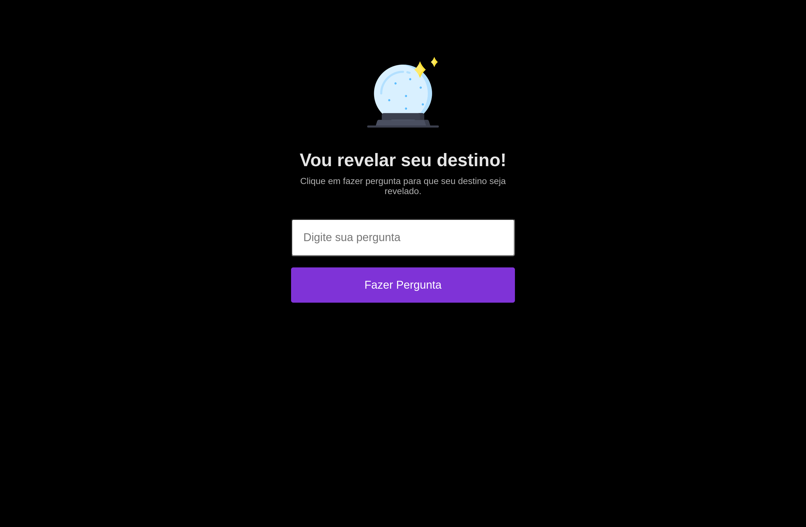

<h1 align="center">
	Found its Destiny
</h1>

<h3 align="center">
	Ask a question so that your fate is revealed
</h3>

	
	

<h4 align="center">
	Status: 🚀 Finished
</h4>

	<a href="#about">About</a> •
	<a href="#tech-stack">Tech Stack</a> •
	<a href="#contact">Contact</a> 

## About
EN = Project created in the Rocketseat Explorer Marathon it aims to answer your questions, the clearer your question the clearer your answer will be like a crystal ball.

PT = Projeto criado na Maratona Explorer da Rocketseat ele tem como objetivo responder suas perguntas, quanto mais claro sua pergunta mais clara será sua resposta como se fosse uma bola de cristal.

## Tech Stack
&nbsp;
&nbsp;
&nbsp;

## Usage
To use this project, go to the link:

<a href="https://igorsilvamedeiros.github.io/found_its_destiny/" target="_blank">Link Project</a>

## Contact

Made with ❤️ by [Igor da Silva](https://github.com/IgorSilvaMedeiros), get in touch!

&nbsp;
&nbsp;

 
